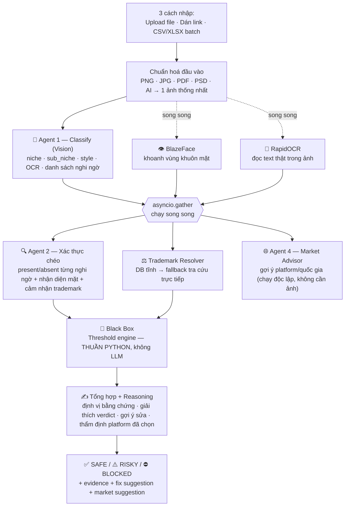

# 🛡️ BUP-02 — AI Design Compliance Checker
## Git Workflow

- **`dev`** — nhánh phát triển chính
- **`main`** — nhánh production

**Hệ thống kiểm duyệt bản quyền/thương hiệu tự động cho ảnh thiết kế Print-on-Demand** — phát hiện logo, nhân vật, người nổi tiếng, trademark text, artwork và font có bản quyền trong 1 ảnh design, ra quyết định **SAFE / RISKY / BLOCKED** kèm lý do cụ thể, gợi ý cách sửa, và đề xuất thị trường/platform phù hợp — trước khi seller đăng bán và bị gỡ listing hoặc khoá tài khoản.

**🚀 Dùng thử ngay: [aspirers.vercel.app](https://aspirers.vercel.app/)** — không cần cài đặt gì, upload 1 ảnh hoặc dán link là thấy kết quả.

---

## 🎯 Điểm nổi bật

- **4 Agent + 1 "hộp đen" quyết định, không phải 1 prompt to duy nhất.** Mỗi Agent làm đúng 1 việc (phân loại → xác thực chéo → tổng hợp & giải thích → gợi ý thị trường), còn **verdict cuối cùng (SAFE/RISKY/BLOCKED) do Python thuần quyết định bằng threshold số** — LLM không bao giờ được tự ý "cho qua" hay "chặn" một mình. Điều này giúp verdict **nhất quán, giải thích được, và audit lại được** — thay vì phụ thuộc hoàn toàn vào "cảm tính" của 1 lần gọi LLM.
- **Cơ chế xác thực chéo 2 tầng, có "nới ngưỡng" khi đủ bằng chứng.** Một cái tên thương hiệu/nhân vật *chưa có* trong cơ sở dữ liệu tham chiếu mặc định chỉ dừng ở mức **RISKY** ("nên kiểm tra thủ công"). Nhưng nếu Agent xác thực thứ 2 (nhìn lại ảnh gốc, độc lập với Agent 1) khẳng định **và giải thích đủ chi tiết vì sao chắc chắn**, hệ thống mới cho phép nới ngưỡng lên **BLOCKED** — giống nguyên tắc "corroborating evidence" trong review nội dung thật, không phải cứ đoán là chặn, cũng không bỏ sót chỉ vì thiếu database.
- **OCR & face detection chạy bằng model thật, không phải LLM đoán mò.** Text trong ảnh được đọc bằng **RapidOCR (ONNX runtime)**, khuôn mặt được khoanh vùng bằng **BlazeFace** (multi-scale sliding-window, tự tinh chỉnh trên ảnh thật) — 2 tác vụ này tốn kém nếu giao hết cho Vision LLM, nên tách riêng thành module CV chuyên biệt, chạy song song với Agent 1 để không cộng dồn thời gian chờ.
- **Batch xử lý streaming thời gian thực**, không phải "gửi rồi ngồi chờ". Kiến trúc NDJSON streaming trả kết quả **từng dòng ngay khi xong** thay vì phải đợi toàn bộ batch hoàn tất mới có phản hồi — vừa tránh timeout với batch nhiều ảnh, vừa cho người dùng thấy tiến độ real-time, vừa giữ được kết quả riêng phần nếu 1 dòng gặp sự cố giữa chừng.
- **Tự động chấm điểm đối chiếu đáp án mẫu.** Khi input có kèm cột `expected_verdict` (đúng format file mẫu thật của ban giám khảo), hệ thống tự so verdict thật với đáp án và xuất `verdict_accuracy` — dùng để tự tinh chỉnh threshold dựa trên dữ liệu thật, không phải chỉnh theo cảm tính.
- **Không hardcode/bịa dữ liệu pháp lý.** Trademark tra cứu qua cơ sở dữ liệu đã biên soạn từ nguồn công khai (USPTO/EUIPO) + fallback tra cứu trực tiếp cho các cụm từ chưa chắc chắn; **không bao giờ để LLM tự sinh số đăng ký/case number** — trích dẫn chỉ được phép khi có nguồn thật.

---

## 🏗️ Kiến trúc hệ thống



Nguyên tắc xuyên suốt: **Python quyết định số/threshold cứng, LLM chỉ giải thích/lý luận** — không có bước nào để 1 lần gọi LLM duy nhất tự quyết định GO/NO-GO nhị phân.

---

## 🧠 Công nghệ & thuật toán cốt lõi

### 1. RapidOCR (ONNX) — đọc chữ thật, không đoán
Text trong thiết kế (tên thương hiệu, slogan, band name...) được trích xuất bằng **RapidOCR chạy trên ONNX Runtime** — pipeline 3 model (detect → classify góc nghiêng → recognize) cho từng vùng chữ, sau đó qua **thuật toán tự gộp block hình học**: so khớp độ chồng lấn theo trục dọc (overlap) + khoảng cách theo trục ngang (gap) để xác định "2 box này có cùng 1 dòng không", rồi cluster các dòng liền kề thành 1 block hoàn chỉnh — tái tạo đúng cách con người đọc 1 đoạn text bị OCR cắt vụn thành nhiều mảnh rời rạc. Kết quả được đưa thẳng vào Trademark Resolver để so khớp database bằng Python — không cần LLM tự OCR lại lần 2.

### 2. BlazeFace — khoanh vùng khuôn mặt, không sinh trắc học
Phát hiện khuôn mặt bằng **BlazeFace** với **multi-scale tiling**: quét ảnh ở 5 mức tỷ lệ chồng lấn khác nhau (từ toàn ảnh tới cửa sổ rất nhỏ) để không bỏ sót khuôn mặt ở xa camera, decode kết quả qua anchor-box đã tinh chỉnh trên ảnh thật. Đây **chỉ là detection** (tìm "có mặt người ở đâu") — **không làm face-recognition/embedding sinh trắc học** để định danh, theo đúng nguyên tắc đạo đức đã chốt: việc nhận diện "đây là ai" giao hoàn toàn cho Vision LLM tự phán đoán trực tiếp trên ảnh đã khoanh vùng, không đối chiếu database khuôn mặt nào.

### 3. YOLOv8n cho logo detection thị giác thuần — đã huấn luyện, đang chờ tích hợp
Song song với cơ chế xác thực chéo bằng Vision LLM (mô tả ở phần "Điểm nổi bật"), đội ngũ đã **tự huấn luyện riêng 1 model YOLOv8n (PyTorch) chuyên biệt cho bài toán phát hiện logo** — fine-tune lại ngưỡng confidence trên dữ liệu thật, nhận diện tốt phần lớn logo thương hiệu phổ biến. Đây là hướng đi **kết hợp LLM zero-shot (phủ rộng, không giới hạn cứng danh sách brand) với model CV chuyên biệt (nhanh, chính xác cao, không tốn token gọi API)** — 2 lớp bổ trợ nhau thay vì chỉ phụ thuộc vào 1 nguồn duy nhất.

Model đã sẵn sàng về mặt thuật toán; việc đưa thẳng vào luồng xử lý real-time đang được cân nhắc kỹ lưỡng về hạ tầng, ưu tiên **một hệ thống chạy ổn định** hơn là tích hợp vội 1 model nặng rồi đánh đổi bằng crash giữa chừng.

### 4. Black Box — threshold hiệu chỉnh bất đối xứng theo rủi ro
Mọi ngưỡng SAFE/RISKY/BLOCKED nằm trong 1 module Python thuần, tách biệt hoàn toàn khỏi LLM:

| Nhóm category | Nguyên tắc hiệu chỉnh |
|---|---|
| NSFW, vũ khí, ma tuý... | Ngưỡng **thấp** — bỏ sót nguy hiểm hơn báo động nhầm |
| Trùng logo/nhân vật/font/artwork | Ngưỡng **cao** — tránh chặn nhầm design gốc chỉ vì "trông hơi giống" |
| Trademark text đã xác nhận | Nhị phân — khớp chính xác database = chặn thẳng, khớp mờ = cảnh báo |

Mỗi category còn có **2 nguồn tín hiệu độc lập** gộp lại (lấy tín hiệu nặng hơn) — vd `logo_similarity` = đối chiếu tên với danh sách tham chiếu **cộng thêm** cơ chế xác thực chéo mô tả ở phần "Điểm nổi bật" phía trên.

### 5. Chuẩn hoá đầu vào đa nguồn, tự nhận diện định dạng thật
- Link Google Drive/Dropbox/Google Sheets/S3 tự viết lại thành link tải trực tiếp.
- File tải về không dựa vào **tên file** để đoán định dạng — **sniff magic bytes thật** (`%PDF-`, `8BPS`, `RIFF/WEBP`...) để phân biệt PDF/PSD/ảnh raster, an toàn kể cả khi link không có đuôi file.
- PDF nhiều trang: render **toàn bộ trang** (không chỉ trang 1), trang dạng digital-native trích thêm **text layer thật kèm bbox pixel chính xác** — dùng để định vị bằng chứng chính xác tuyệt đối thay vì để Vision ước lượng vị trí.
- File `.ai` (Adobe Illustrator) tái sử dụng nguyên vẹn pipeline PDF — vì mọi file `.ai` hiện đại đều nhúng sẵn 1 bản PDF tương thích bên trong theo mặc định của Illustrator.

### 6. Batch streaming NDJSON — không còn "gửi rồi im lặng chờ"
Batch xử lý hàng loạt trả kết quả theo giao thức **NDJSON streaming**: mỗi thiết kế xử lý xong được đẩy về ngay lập tức (1 dòng JSON/thiết kế), thay vì gom hết mới trả 1 response khổng lồ — giữ kết nối luôn có dữ liệu chảy qua (tránh timeout ở các tầng hạ tầng trung gian với batch chạy nhiều phút), đồng thời cho phép giao diện hiện tiến độ real-time và **giữ lại kết quả riêng phần** nếu có sự cố ở giữa batch thay vì mất trắng toàn bộ.

---

## 📥 3 cách nhập input

| Cách nhập | Mô tả |
|---|---|
| **Upload file** | PNG / JPG / PDF (multi-page) / PSD / AI |
| **Dán link** | Google Drive, Dropbox, Google Sheets, hoặc URL ảnh trực tiếp |
| **Batch CSV/XLSX** | Danh sách hàng loạt design (path/link + metadata tuỳ chọn: platform, target_country, niche_hint) — hỗ trợ cả ảnh dán trực tiếp vào ô Excel, không cần upload lên đâu lấy link trước |

Mỗi thiết kế trả về: niche/sub-niche/style, toàn bộ text OCR được, danh sách nghi ngờ (logo/nhân vật/celeb/font/artwork) kèm trạng thái đã xác thực, verdict cuối cùng kèm bằng chứng theo từng category, khung khoanh vùng thật trên ảnh gốc (không phải LLM đoán toạ độ), reasoning, gợi ý sửa cho từng vi phạm, và gợi ý platform/quốc gia phù hợp.

---

## 📊 Dữ liệu tham chiếu

Toàn bộ danh sách tham chiếu (niche/sub-niche, style, motif, nhãn hiệu, nhân vật, người nổi tiếng, chính sách từng platform, xu hướng thị trường) được **biên soạn có chọn lọc** thay vì cố phủ hết mọi trường hợp — ưu tiên đúng những nhóm rủi ro xuất hiện nhiều nhất trong thực tế, giữ kích thước gọn để việc tiêm vào prompt và đối chiếu vẫn nhanh, không làm phình thời gian phản hồi hay đội chi phí token.

Điểm đáng chú ý: bộ **niche taxonomy** không chỉ tự tổng hợp thủ công mà còn được **đối chiếu và mở rộng trực tiếp từ chính bộ dữ liệu mẫu thật của ban giám khảo** (30 test case thật, bao phủ đủ các nhóm rủi ro cao nhất trong thực tế: band merch, celebrity, sports, streetwear cao cấp...) — đảm bảo hệ thống phân loại đúng ngôn ngữ/cách gọi mà bộ đề thật đang dùng, không phải đoán mò từ kiến thức chung chung.

Trademark text được tra cứu 2 lớp: **lớp tĩnh** (danh sách đã biên soạn từ USPTO/EUIPO, tra cứu tức thời, miễn phí) chạy trước cho mọi cụm từ; chỉ những cụm **thật sự chưa chắc chắn** mới rơi xuống **lớp tra cứu trực tiếp** (USPTO/EUIPO), có cache trong phạm vi 1 lượt batch để không tra trùng — giữ hệ thống vẫn chạy được đầy đủ ngay cả khi mất kết nối mạng tới các API tra cứu ngoài.

---

## 🛠️ Chạy ở máy local (dev)

```bash
# 1. Cài dependency (từ thư mục gốc repo)
pip install -r requirements.txt

# 2. Cấu hình API key — copy example_env.txt thành backend/.env rồi điền GEMINI_API_KEY thật
cp example_env.txt backend/.env

# 3. Chạy backend
cd backend
python main.py          # http://localhost:8000

# 4. Chạy frontend (React + Vite, terminal khác)
cd frontend-react
npm install
npm run dev              # http://localhost:5173
```

Toàn bộ pipeline (4 Agent + OCR + face detection) chạy được ngay trên máy local với đúng 1 API key Claude — không cần thêm hạ tầng nào khác. Muốn test nhanh không cần build frontend: `frontend/index.html` (bản thuần HTML/JS) mở trực tiếp bằng trình duyệt là dùng được luôn.

---

## 📁 Cấu trúc project

```
backend/
├── compliance_checker/
│   ├── schemas.py           # Pydantic contract cho MỌI input/output giữa các agent
│   ├── orchestrator.py      # Điều phối pipeline — nơi asyncio.gather/streaming thật sự nằm
│   ├── engine/
│   │   ├── agents.py            # Prompt + gọi LLM cho 4 Agent
│   │   ├── black_box.py         # Threshold engine — quyết định verdict, thuần Python
│   │   ├── opencv_modules.py    # RapidOCR, BlazeFace, contract cho module CV
│   │   └── trademark_resolver.py
│   ├── ingestion/            # Chuẩn hoá mọi định dạng input về 1 ảnh thống nhất
│   ├── api/routes.py         # 6 route: check, check-upload, batch-csv(-stream), batch-json(-stream)
│   └── data/                 # Toàn bộ dữ liệu tham chiếu (niche, trademark, policy, trend...)
└── main.py

frontend-react/               # React + Vite + TypeScript — giao diện chat, đang deploy tại aspirers.vercel.app
frontend/                     # Bản thuần HTML/JS, không cần build — dùng cho test nhanh
```

---

**Dùng thử ngay tại 👉 [aspirers.vercel.app](https://aspirers.vercel.app/)**
